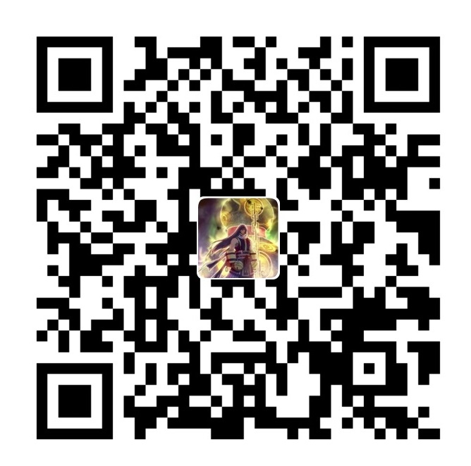

Voice is best gift for you!

捐赠：支付宝 w079064@163.com ，支付宝二维码（左），微信二维码（右）

  

 

## 苏轼(苏东坡)的词

Link:

### 江城子 乙卯正月二十日夜记梦
> [宋] 苏轼   
> 十年生死两茫茫，不思量，自难忘。千里孤坟，无处话凄凉。纵使相逢应不识，尘满面，鬓如霜。   
> 夜来幽梦忽还乡，小轩窗，正梳妆。相顾无言，惟有泪千行。料得年年肠断处，明月夜，短松冈。   

### 定风波·莫听穿林打叶声
> [宋] 苏轼   
> 三月七日沙湖道中遇雨。雨具先去，同行皆狼狈，余独不觉。已而遂晴，故作此词。   
> 莫听穿林打叶声，何妨吟啸且徐行。    
> 竹杖芒鞋轻胜马，谁怕？一蓑烟雨任平生。    
>    
> 料峭春风吹酒醒，微冷，山头斜照却相迎。    
> 回首向来萧瑟处，归去，也无风雨也无晴。   

### 念奴娇 赤壁怀古
> [宋] 苏轼   
> 大江东去，浪淘尽，千古风流人物。   
> 故垒西边，人道是，三国周郎赤壁。   
> 乱石穿空，惊涛拍岸，卷起千堆雪。   
> 江山如画，一时多少豪杰。   
> 遥想公瑾当年，小乔初嫁了，雄姿英发。   
> 羽扇纶巾，谈笑间，樯橹灰飞烟灭。   
> 故国神游，多情应笑我，早生华发。   
> 人生如梦，一尊还酹江月。   

### 水调歌头·明月几时有
> [宋] 苏轼  
> 丙辰中秋，欢饮达旦，大醉，作此篇。兼怀子由。  
> 明月几时有，把酒问青天。   
> 不知天上宫阙，今夕是何年？   
> 我欲乘风归去，又恐琼楼玉宇，   
> 高处不胜寒。   
> 起舞弄清影，何似在人间！   
>   
> 转朱阁，低绮户，照无眠。   
> 不应有恨，何事长向别时圆？   
> 人有悲欢离合，月有阴晴圆缺，   
> 此事古难全。   
> 但愿人长久，千里共婵娟。  

### 水调歌头·安石在东海
> [宋] 苏轼   
> 余去岁在东武，作《水调歌头》以寄子由。今年子由相从彭门居百余日，过中秋而去，作此曲以别。余以其语过悲，乃为和之，其意以不早退为戒，以退而相从之乐为   
> 安石在东海，从事鬓惊秋。    
> 中年亲友难别，丝竹缓离愁。    
> 一旦功成名遂，准拟东还海道，扶病入西州。    
> 雅志困轩冕，遗恨寄沧洲。    
>    
> 岁云暮，须早计，要褐裘。    
> 故乡归去千里，佳处辄迟留。    
> 我醉歌时君和，醉倒须君扶我，惟酒可忘忧。    
> 一任刘玄德，相对卧高楼。   

## 唐诗三百首

Link:

